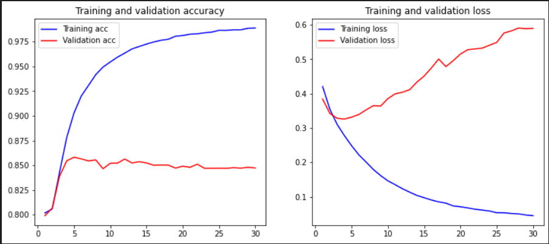
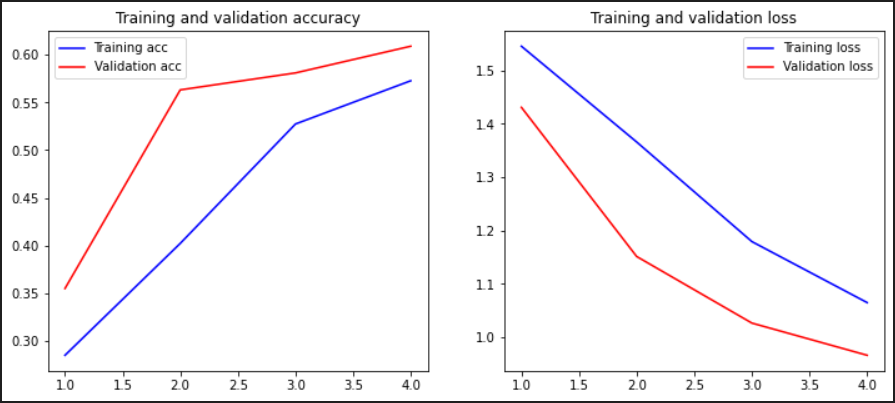

# Sentiment Analysis of COVID-19 Pandemic using NLP and Machine Learning

## Introduction

The COVID-19 pandemic has significantly impacted the world, leading to a surge of information and opinions shared across various platforms. Understanding public sentiment during such crises is crucial for policymakers, health organizations, and businesses to respond effectively, mitigate panic, and address public concerns. This project aims to analyze the sentiment of social media posts and other textual data related to COVID-19 using Natural Language Processing (NLP) and Machine Learning techniques. By examining how people perceive and react to the pandemic, we can gain valuable insights to guide decision-making and communication strategies.

## Experiment Overview

The primary objective of this project is to perform sentiment analysis on text data concerning the COVID-19 pandemic. The process involves several key steps:

1. **Data Collection**: Gathering a diverse set of textual data related to COVID-19 from various sources.
2. **Data Preprocessing**: Cleaning, normalizing, and tokenizing the text data to prepare it for analysis.
3. **Vectorization**: Converting text data into numerical representations using different vectorization methods such as word embeddings, Bag of Words, and TF-IDF.
4. **Model Training**: Utilizing two different classifiers/models—Deep Learning with Artificial Neural Networks and Linear Regression—to predict sentiment.
5. **Evaluation and Results**: Displaying the performance of the models through plots and tables to compare their effectiveness.

## Data Collection

The data was collected from multiple sources including social media platforms, news articles, and online forums. The dataset includes a mix of positive, negative, and neutral sentiments towards COVID-19.

## Data Preprocessing

The collected data underwent several preprocessing steps:
- **Cleaning**: Removing noise, special characters, and irrelevant information.
- **Normalizing**: Standardizing text to a uniform format.
- **Tokenizing**: Splitting text into individual tokens for analysis.

## Vectorization Methods

Three different vectorization techniques were employed to transform the text data into numerical format:
- **Word Embeddings**: Representing words in a continuous vector space where semantically similar words are closer.
- **Bag of Words (BoW)**: Creating a sparse matrix of word occurrences.
- **TF-IDF (Term Frequency-Inverse Document Frequency)**: Reflecting the importance of a word in a document relative to a collection of documents.

## Model Training and Evaluation

To ensure robust model performance and avoid overfitting, the dataset was divided into three parts: training, cross-validation, and testing sets. 

- **Training Set**: Used to train the models, this set contains the majority of the data and allows the models to learn the underlying patterns.
- **Cross-Validation Set**: This set is used to fine-tune the models and select the best hyperparameters. By evaluating model performance on the cross-validation set, we can optimize the models without overfitting to the training data.
- **Testing Set**: The final set, which is used to evaluate the performance of the models after training and hyperparameter tuning. This set provides an unbiased assessment of how well the models generalize to new, unseen data.

Two different models were trained to classify the sentiment of the text data:
- **Deep Learning with Artificial Neural Networks (ANN)**: Leveraging the power of deep learning to capture complex patterns in the data.
- **Linear Regression**: A simple yet effective model for sentiment prediction.

## Screenshots

## Conclusion

The sentiment analysis of COVID-19-related text data provides valuable insights into public perception during the pandemic. The use of different vectorization methods and machine learning models allows for a comprehensive analysis of the data. The results indicate that [insert key findings here], which can help in formulating better communication strategies and policies to address public concerns effectively.

